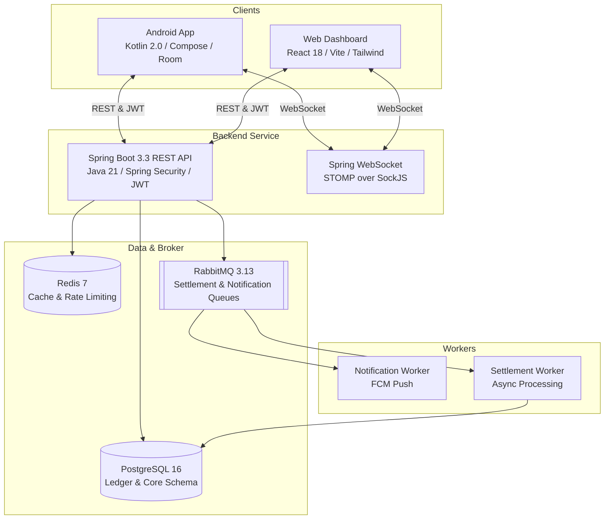

# 💸 SettleUp — Group Expense Splitting & Ledger Accounting Platform

<p align="center">
  
  
  
  
  
  
  
  
</p>

---

## 🌟 Overview

**SettleUp** is a full-stack, enterprise-grade group expense-splitting platform designed around **double-entry ledger accounting**. Unlike traditional expense trackers that rely on mutable balance tables subject to race conditions and drift, SettleUp derives all balances immutably from paired credit/debit ledger entries.

The system features an **offline-first Android client** with background synchronization, a **real-time React/Vite web dashboard**, and an **event-driven Spring Boot microservice backend** backed by PostgreSQL, Redis, and RabbitMQ.

---

## 🏛️ Core Architectural Principles

### 1. Immutable Double-Entry Ledger Accounting
- **No Mutable Balances:** We never store a mutable `balance` column. All balances are derived by summing immutable `LedgerEntry` records (`SUM(credit_amount) - SUM(debit_amount)`).
- **Strict Equilibrium:** Every expense transaction enforces `SUM(debit_amount) == SUM(credit_amount)` across all involved parties.
- **Audit Trails via Reversals:** Transactions are never overwritten or deleted. Corrections are modeled as accounting reversals (equal and opposite entries) followed by a new transaction entry.

### 2. Debt Simplification Engine
- Uses graph reduction algorithms to minimize the number of payment edges within a group, converting complex multi-person debt cycles into the fewest direct settlements possible.

### 3. Asynchronous & Event-Driven
- Heavy workloads—such as multi-user settlement simulations, push notifications (FCM), and WebSocket event broadcasting—are decoupled using **RabbitMQ** queues and background worker consumers.

---

## 📐 System Architecture



---

## 📂 Project Structure

This repository is organized as a monorepo containing three primary subsystems and a complete specification:

```
SettleUp/
├── 📜 SettleUp_Build_Spec.md     # Complete technical specification, database schema, & API design
├── 📁 settleup-backend/          # Spring Boot 3.3 (Java 21) REST & WebSocket API
│   ├── docker-compose.yml        # Local containers for PostgreSQL, Redis, and RabbitMQ
│   ├── pom.xml                   # Maven project configuration
│   └── src/main/java/            # Controllers, Services, Ledger DB Models, Security, Workers
├── 📁 settleup-android/          # Offline-First Android App (Kotlin 2.0 + Jetpack Compose)
│   ├── app/src/main/             # Compose UI, Room Database, WorkManager Sync, Hilt DI
│   └── build.gradle.kts          # Gradle build scripts with version catalogs
└── 📁 settleup-web/              # Real-time Admin & Web App (React 18 + Vite + Tailwind CSS)
    ├── src/                      # TanStack Query hooks, WebSocket hooks, and UI Pages
    └── package.json              # Web frontend dependencies & scripts
```

---

## 🚀 Quick Start Guide

### Prerequisites
- **Java 21** JDK & Maven 3.9+
- **Node.js 20+** & npm
- **Docker & Docker Compose** (for running local PostgreSQL, Redis, and RabbitMQ)
- **Android Studio** (for Android app development)

---

### 1. Start Infrastructure Services (Docker)
Navigate to the `settleup-backend` directory and start PostgreSQL, Redis, and RabbitMQ containers:

```bash
cd settleup-backend
docker-compose up -d
```

---

### 2. Run the Backend API (Spring Boot)
Once the Docker services are running, launch the backend server:

```bash
cd settleup-backend
mvn spring-boot:run
```
*The API server starts by default at `http://localhost:8080` with Swagger / API endpoints ready.*

---

### 3. Run the Web Dashboard (React + Vite)
In a new terminal window, start the frontend development server:

```bash
cd settleup-web
npm install
npm run dev
```
*Access the UI at `http://localhost:5173`.*

---

### 4. Build & Run the Android Client
Open `settleup-android/` in **Android Studio** or build from the command line:

```bash
cd settleup-android
./gradlew assembleDebug
```
*Install the resulting APK onto an Android emulator or physical device.*

---

## 🔐 API Reference Highlights

| Endpoint | Method | Description |
|---|---|---|
| `/api/auth/register` | `POST` | Register a new user with JWT issuance |
| `/api/auth/login` | `POST` | Authenticate and obtain JWT access & refresh tokens |
| `/api/groups` | `POST` | Create a new expense group |
| `/api/groups/{id}/expenses` | `POST` | Record an expense with automatic ledger credit/debit generation |
| `/api/groups/{id}/balances` | `GET` | Fetch derived immutable user balances across the group |
| `/api/groups/{id}/simplify` | `GET` | Calculate simplified debt settlements between members |
| `/api/settlements` | `POST` | Record a direct payment settlement between members |

---

## 📜 Specification & Documentation

For a comprehensive breakdown of the database schema (with exact Postgres tables and constraints), double-entry accounting mathematical proofs, WebSocket topic formats, and queue message payloads, refer to **[SettleUp_Build_Spec.md](file:///e:/SplitLedger/SettleUp_Build_Spec.md)**.

---

## 📄 License

This project is open-source and licensed under the MIT License.
